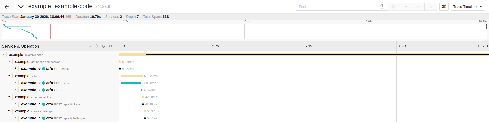

# Example - OpenTelemetry

At scale, understanding what led your CTFd to its current state can help you understand an incident, or how many interactions are happening under the hood in your distributed system.

This is something we want to provide, first for our own usage, but secondly as a proof-of-concept for the community to see how it can be technically achieved.

## Try it out!

- Run an OpenTelemetry Collector to capture signals (here we focus on traces), Jaeger for distributed traces visualization, and our [instrumented and repackaged CTFd](https://github.com/ctfer-io/ctfd-packaged) for OpenTelemetry support.
    ```bash
    docker compose up
    ```

- Run the example, with OpenTelemetry exporters settings.
    ```bash
    OTEL_EXPORTER_OTLP_ENDPOINT=dns://localhost:4317 OTEL_EXPORTER_OTLP_INSECURE=true go run main.go
    ```

- Open Jaeger and visualize traces: [`http://localhost:16686`](http://localhost:16686)
<div align="center">
    
</div>

- You can delete the infra :wink:
    ```bash
    docker compose down -v
    ```
